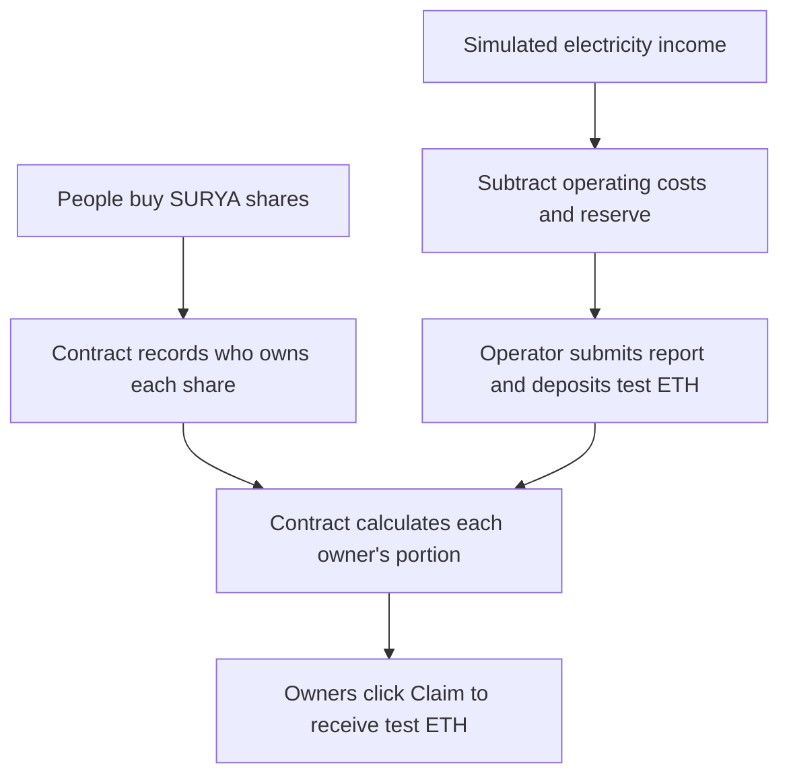

# SuryaShare ☀️

**Own the sunshine. Share the future.**

SuryaShare is an Ethereum hackathon prototype where people buy digital shares in a fictional Indonesian solar project and claim a proportional share of its simulated income.

Buy shares → the operator deposits demo income → shareholders claim their portion.

**Working blockchain transactions. Simulated solar data. No real money or physical hardware required.**

## What you can do

- Buy SURYA shares and see your ownership percentage.
- Track holdings, claim income, and transfer shares to another wallet.
- Publish sample monthly energy reports and fund payouts as the operator.
- Inspect blockchain transaction receipts for purchases, reports, transfers, and claims.
- Switch between Alice, Budi, and the solar operator for a complete local demonstration.

The interface uses sunny yellow, ivory, and navy, with large headlines and a clear path from learning about the project to buying shares. Pages include Home, Buy shares, How it works, My shares, and Demo lab.

## Run locally

**Public website preview:** [geraldadli.github.io/SuryaShare](https://geraldadli.github.io/SuryaShare/).

GitHub Pages hosts the interface and income calculator. Until a Sepolia deployment is connected, purchases, wallet connections, transfers, and claims remain unavailable in the preview. Once connected, transactions run on Sepolia without a local server. Pushes to `main` automatically rebuild the site through `.github/workflows/pages.yml`.

Use **Node.js 24** and npm. From your copy of the project:

```sh
cd SuryaShare
npm ci
npm start
```

For the existing Windows workspace, open PowerShell and run:

```powershell
cd D:\Project-Website\SuryaShare
npm.cmd ci
npm.cmd start
```

Open [SuryaShare locally](http://127.0.0.1:5173). Keep the terminal open; press **Ctrl+C** to stop.

`npm start` starts the local blockchain, deploys the contract, and launches the website. No wallet extension or faucet is needed for the built-in demo accounts. Ports **8545** and **5173** must be available.

**Restarting creates a fresh blockchain:** local purchases, reports, and claims reset. The demo accounts are public disposable test accounts; never use them for real funds.

## Try the full demo

1. Choose **Alice** and buy **100 shares** for a displayed **Rp10,000,000**. She now owns **10%** of the 1,000 shares.
2. Choose **Budi** and buy **50 shares**. He owns **5%**.
3. Choose **Solar operator** and open **Demo lab**. Publish the default October 2026 report:

   | Sample report | Amount |
   | --- | ---: |
   | Electricity income: 1,200 kWh × Rp1,500 | Rp1,800,000 |
   | Operating costs | −Rp400,000 |
   | Reserve | −Rp200,000 |
   | Income deposited for shareholders | **Rp1,200,000** |

4. Switch to **Alice**. Her claimable income is **Rp120,000**: 10% of Rp1,200,000. Claim it and view the transaction receipt.
5. Switch to **Budi**. He can claim **Rp60,000**. The operator holds the remaining 850 shares and earns **Rp1,020,000**.
6. Optionally transfer 10 shares from Alice to Budi. Previously earned income stays with its original owner; future reports use the new ownership balances.

For the **Alice earns Rp500,000** example, use 4,000 kWh, Rp800,000 costs, and Rp200,000 reserve. This produces a Rp5,000,000 deposit, of which Alice's 100 shares earn 10%. Use a later month if a report already exists. These are illustrative inputs, not a solar-output forecast.

The app refreshes chain data after transactions and wallet switches. Use **Refresh** for changes made in another tab.

## How the system works



The operator's deposit represents money left from electricity sales after costs and reserves. It is separate from the money used to buy shares. In this prototype, the operator manually enters the report and funds it with test ETH.

**Deposits increase claimable income, not the token price.** Calculations happen automatically in the contract, but the operator must deposit and each owner must claim. Claiming does not consume their shares.

The energy model is **solar project → grid/utilities → energy users**. That physical layer is simulated. The working blockchain layer records ownership, reports, deposits, transfers, and claims. Blockchain proves what was recorded and paid; it does not verify that the reported electricity was actually generated.

## Demo economics and boundaries

| Item | Demo value |
| --- | --- |
| Project | Fictional Cikarang rooftop solar installation |
| Token | SURYA, an ERC-20 with whole shares |
| Total supply | 1,000 shares |
| Purchase price per share | Rp100,000 displayed / 0.0001 test ETH |
| Display conversion | Rp1 demo IDR = 1 gwei; Rp1,000,000 = 0.001 test ETH |
| Report tariff | Rp1,500 per kWh |

The IDR display is a fixed demonstration scale, **not an exchange rate or fiat payment**. Tokens provide no legal ownership rights. No live meter, oracle, utility integration, asset verification, or real investment offering is connected.

Transfers are supported; a paid resale marketplace is not implemented. Unsold shares remain with the operator and earn their proportional income. The contract separates purchase proceeds from income owed to shareholders and preserves earned income across transfers and later purchases. Reports must use unique, chronological months.

Only the operator wallet can publish reports or withdraw purchase proceeds. Local account switching intentionally lets anyone demonstrate that role. The contract is unaudited and restricted to the local chain (31337) and Sepolia (11155111).

## Development

Built with HTML, CSS, JavaScript, Vite, ethers, Solidity, OpenZeppelin ERC-20 and ReentrancyGuard, solc, and a Hardhat local node. No database or backend service is required.

| File | Purpose |
| --- | --- |
| `contracts/SuryaShare.sol` | Shares, purchases, reports, and payout accounting |
| `src/main.js` | Pages, wallet connections, and contract interaction |
| `src/style.css` | Responsive interface and visual design |
| `scripts/start.mjs` | Start the local chain, deployment, and website |
| `scripts/deploy.mjs` | Deploy and generate frontend contract configuration |
| `tests/contract.test.mjs` | EVM integration checks |

For separate processes, run these in order, keeping the chain running in its own terminal:

```sh
npm run chain
# In a second terminal:
npm run deploy
npm run dev
```

Do not run these alongside `npm start`. On Windows, use `npm.cmd` if PowerShell blocks `npm`.

With the local chain running:

```sh
npm test
npm run build
```

Tests deploy a separate contract and do not modify the website's contract. They cover purchase validation, operator permissions, report validation, exact deposits, proportional payouts, later purchases, transfers, duplicate claims, sold-out inventory, and separation of purchase proceeds from payout liabilities.

The production build is written to `dist/`. A static frontend still needs a running, configured blockchain RPC.

## Optional Sepolia deployment

### Deploy with your browser wallet (no private-key export)

1. Open [the deployment page](https://geraldadli.github.io/SuryaShare/deploy.html) in a browser with an Ethereum wallet, such as MetaMask.
2. Select Sepolia and fund a dedicated operator wallet with free Sepolia test ETH. The page links to faucet options.
3. Connect that wallet and choose **Deploy on Sepolia**. Review and confirm the network fee in your wallet. The deploying wallet becomes the permanent operator.
4. Copy the deployment transaction hash shown on the page. Connect the confirmed deployment from the repository:

   ```sh
   npm run connect:sepolia -- 0xYOUR_DEPLOYMENT_TRANSACTION_HASH
   ```

5. Commit the generated `deployments/sepolia.json` and push to `main`. GitHub Actions publishes the connected site automatically. This file contains public contract information, not a private key.

`connect:sepolia` verifies the network, successful deployment receipt, contract bytecode, operator, and share supply before saving configuration. `build:pages` uses that configuration when present and keeps preview mode otherwise. Public builds never include the local deployment configuration.

Investors use their own wallets with Sepolia test ETH. The operator publishes and funds reports from the deploying wallet. Alice/Budi shortcuts remain local-only. Solar data and IDR amounts are still simulated; transactions and balances persist on Sepolia. The public RPC is a shared service and may impose rate limits.

### Command-line alternative

No public testnet deployment has been performed. To deploy on Sepolia, set these environment variables in your shell:

- `RPC_URL`: Sepolia RPC endpoint used for deployment.
- `PUBLIC_RPC_URL`: browser-safe Sepolia RPC endpoint.
- `DEPLOYER_PRIVATE_KEY`: funded disposable testnet deployer key.

Then run `npm run deploy` followed by `npm run dev`. The scripts do not automatically load a `.env` file. Never commit private keys. Generated `public/deployment.json` is browser-visible, so its RPC URL must not contain secrets.

Use a browser wallet connected to Sepolia, with the deployer wallet for operator actions. Investors need Sepolia test ETH. Built-in local demo accounts are unavailable on Sepolia, and receipts link to Sepolia Etherscan when configured.

**Do not use `npm start` for Sepolia:** it creates a fresh local deployment and replaces the frontend deployment configuration.

For GitHub Pages, run `npm run connect:sepolia -- <deployment transaction hash>` using the hash printed by the deploy script, then commit the generated configuration and push. Run `npm run test:pages` to build and check the public artifact locally.
