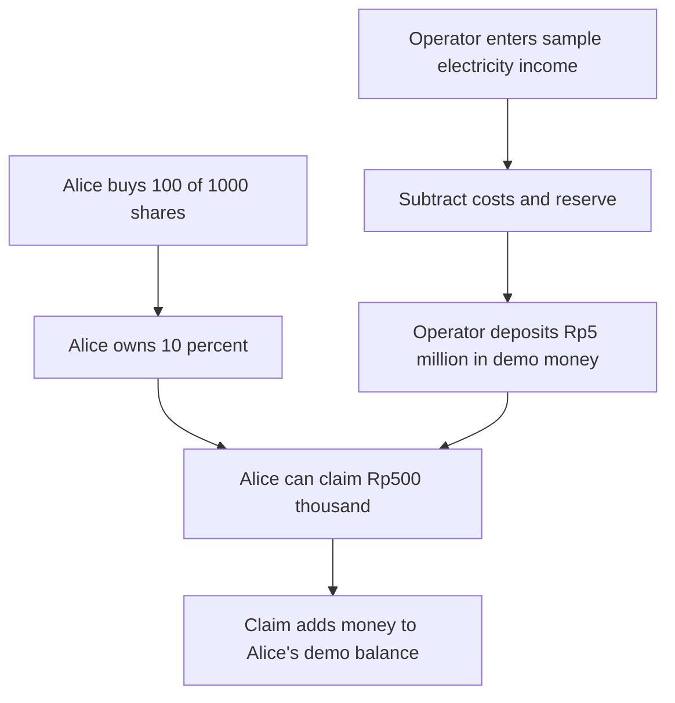

# SuryaShare ☀️

**Own the sunshine. Share the future.**

A hackathon prototype for shared solar ownership. The public website runs a complete **browser simulation**: buy shares, publish sample income, transfer shares, and claim payouts without installing a wallet.

**All money, shares, reports, and receipts on the public demo are simulated. No blockchain transactions are sent.**

## Try it online

Open [SuryaShare](https://geraldadli.github.io/SuryaShare/). Alice is selected automatically. Alice, Budi, and the solar operator each start with **Rp100,000,000 in demo money**.

1. As Alice, buy **100 shares** for **Rp10,000,000**. She owns 10% of the 1,000 shares.
2. Use the top-right role button to choose **Solar operator**, then open **Demo lab**.
3. Enter **4,000 kWh**, **Rp800,000 costs**, and **Rp200,000 reserve**. Publish the report to distribute **Rp5,000,000**.
4. Switch to Alice and open **My shares**. Claim **Rp500,000**, her 10% portion.
5. Try Budi, share transfers, and later reports. Previously earned income stays with its original owner.

Progress survives reloads in the same browser tab. Each tab and visitor has a separate simulation. Open **About this demo → Reset demo** to start fresh. Demo receipts are simulation records, not blockchain proof.

## How it works



The deposit represents income left from electricity sales after expenses and reserves. Purchase proceeds are accounted for separately. Income increases the amount owners can claim; it does not automatically increase the share price or consume shares.

The project, electricity readings, and money are fictional. No hardware, meters, utility services, fiat payments, or legal ownership rights are connected. The operator's unsold shares also receive their proportional income. Transfers move shares, not previously earned income, and are not paid resale transactions.

## Run the browser simulation locally

Use Node.js 24 and npm:

```sh
npm ci
npm run demo
```

Open http://127.0.0.1:5173. No blockchain node, faucet, or wallet extension is needed. Keep the terminal open. On Windows, use `npm.cmd` if PowerShell blocks `npm`.

The existing Windows project is at `D:\Project-Website\SuryaShare`.

## Deployment and checks

Pushes to `main` automatically test, build, and publish the browser simulation on GitHub Pages.

```sh
npm run test:simulation
npm run test:pages
```

The simulation check covers purchases, role restrictions, exact payout accounting, later purchases, transfers, duplicate claims, persistence, storage failures, and reset. The Pages check verifies asset paths and ensures neither the deployment tool nor local blockchain configuration is published.

Build the public site with `npm run build:pages`. Output goes to `dist/`. Preview it with `npm run preview -- --base=/SuryaShare/`.

## Optional local blockchain version

The Solidity contract and Ethereum integration remain available for later development:

```sh
npm start
```

This starts a Hardhat node, deploys the contract, and launches the website. Stop any existing server on port 5173 first. Restarting the chain resets its state. Local demo accounts are disposable test accounts.

With that chain running, `npm test` checks the actual EVM contract. `npm run build` creates the blockchain frontend and wallet deployment page. These are separate from the browser-only public demo.

The contract has 1,000 whole SURYA shares at 0.0001 test ETH per share, displayed as Rp100,000. Its presentation scale is Rp1 demo IDR = 1 gwei, not a real exchange rate. Purchases, operator reports, deposits, claims, transfers, and proceeds withdrawal run on the local EVM. Deployment is restricted to chain 31337 or Sepolia 11155111. The contract is unaudited and not intended for real funds.

Optional Sepolia tools (`scripts/deploy.mjs`, `scripts/connect-sepolia.mjs`, and `deploy.html`) remain in the source. The current Pages build deliberately publishes only the simulation. Adding a Sepolia configuration file does not enable blockchain transactions on the public demo.

## Implementation

HTML, CSS, JavaScript, Vite, ethers, Solidity, OpenZeppelin, solc, and Hardhat. No database or backend is needed for the browser simulation.

| File | Purpose |
| --- | --- |
| `src/main.js` | Screens, role selection, and interactions |
| `src/simulation.js` | Demo balances, ownership, income, and tab persistence |
| `src/style.css` | SolarCoin-inspired yellow, ivory, and navy interface |
| `contracts/SuryaShare.sol` | Optional on-chain ownership and accounting |
| `scripts/build-pages.mjs` | Browser-only public build |
| `.github/workflows/pages.yml` | Automatic GitHub Pages deployment |
